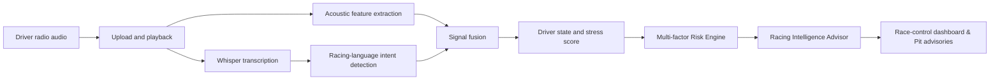

# REVORA

> **AI that hears the driver before the numbers tell the story.**

REVORA is an AI co-driver for motorsport teams. It turns driver-radio audio into a transcript, detects racing-specific intent, estimates the driver's current state, and presents the result in a race-control dashboard.

During a race, engineers are already watching telemetry, strategy, traffic, and lap times. Subtle signs of stress, fatigue, or frustration in a driver's voice can be missed. REVORA makes those signals visible and actionable without asking the team to stop and replay every radio call.

## What the working MVP does

1. Accepts a real driver-radio recording.
2. Transcribes the speech with Hugging Face Whisper.
3. Extracts acoustic signals such as energy, zero-crossing rate, and spectral centroid.
4. Detects racing-language intent, including tyre complaints, grip issues, urgent requests, and handling concerns.
5. Fuses voice and language signals into a driver-state label, stress score, and confidence score.
6. Sends the result to the React dashboard immediately.

### Live AI vs. demo context

| Capability | Status |
| --- | --- |
| Audio upload and playback | Live |
| Speech-to-text transcription | Live — `openai/whisper-tiny.en` |
| Acoustic stress features | Live — librosa |
| Racing-intent detection | Live |
| Driver state, stress, and confidence | Live |
| Multi-factor Risk Engine (0-100 score, level & trend) | Live |
| AI Racing Intelligence & Strategy Advisor | Live |
| Lap history, timeline, and alerts | Simulated demo context |

The distinction is intentional: the submitted AI pipeline, risk engine, and strategy advisor are real, while the surrounding race-session data demonstrates how their outputs would be used in a complete pit-wall product.

## How it works



The current state labels are `CALM`, `FOCUSED`, `STRESSED`, and `CRITICAL`. The system can also identify intents such as `TYRE_COMPLAINT`, `GRIP_ISSUE`, `HANDLING_CONCERN`, `STRATEGY_FRUSTRATION`, and `URGENT_REQUEST`.

---

## Racing Intelligence & Risk Engine

### 1. Risk Engine (`backend/app/risk_engine/`)
- Evaluates multi-factor composite risk:
  $$\text{Composite Risk} = 0.40 \cdot \text{StressRisk} + 0.35 \cdot \text{IntentRisk} + 0.25 \cdot \text{PaceDegradationRisk}$$
- Categorizes risk levels (`LOW`, `MODERATE`, `HIGH`, `CRITICAL`) and evaluates risk trends (`STABLE`, `RISING`, `FALLING`).
- Established convention: positive `lap_delta` (`+0.8s`) indicates slower pace relative to reference baseline.

### 2. Racing Intelligence Advisor (`backend/app/racing_intelligence/`)
- Correlates driver audio state signals + telemetry + risk assessment.
- Formulates actionable pit strategy advisories (e.g., `BOX THIS LAP`, target compound `HARD`), explainable bullet-point evidence, and radio callouts.


---

## Demo

Start both applications, open `http://localhost:5173`, then:

1. Find the **Driver Radio** panel.
2. Select `data/driver-radio-test.wav`, or upload your own short recording.
3. Click **Run HF Analysis**.
4. Confirm that the transcript, state, stress score, confidence, and detected intent update from the backend response.
5. Press play to compare the recording with the generated transcript.

One verified test produced:

```text
Transcript:   Rear tires are completely gone. Box this lap.
Driver state: STRESSED
Stress score: 60 / 100
Vocal stress: 62 / 100
Confidence:   64%
Intents:      URGENT_REQUEST, TYRE_COMPLAINT
```

Model inference can take longer on the first request while the model is loaded. Later requests are substantially faster.

## Tech stack

| Layer | Technology |
| --- | --- |
| Frontend | React 18, TypeScript, Vite |
| Backend | FastAPI, Pydantic, Uvicorn |
| Speech recognition | Hugging Face Transformers, Whisper |
| Audio analysis | librosa, NumPy |
| ML runtime | PyTorch |

## Run locally

### Prerequisites

- Python 3.11 or newer
- Node.js 18 or newer
- npm
- FFmpeg for formats such as MP3, M4A, OGG, and WebM

### 1. Start the backend — Windows PowerShell / CMD

```powershell
cd backend
python -m pip install -r requirements.txt
python -m uvicorn app.main:app --host 127.0.0.1 --port 8000 --reload
```

Keep that window open. API documentation will be available at `http://127.0.0.1:8000/docs`.

### 2. Start the frontend — another PowerShell window

```powershell
cd frontend
npm install
npm run dev
```

Open `http://localhost:5173`.

### Optional Hugging Face configuration

```bat
set HF_TOKEN=your_hugging_face_token
set HF_ASR_MODEL=openai/whisper-tiny.en
set HF_AUDIO_MODEL=superb/wav2vec2-base-superb-er
set HF_ENABLE_AUDIO_MODEL=1
set HF_DEVICE=-1
```

`HF_ENABLE_AUDIO_MODEL=0` is the tested default. It uses Whisper plus local acoustic features. Setting it to `1` also enables the configured Hugging Face audio-classification model and increases model-loading time and resource usage.

## Verify the implementation

### Backend health and model status

```bat
curl http://127.0.0.1:8000/api/health
curl http://127.0.0.1:8000/api/analysis/models
```

### Analyze a recording directly

```bat
curl -X POST http://127.0.0.1:8000/api/analysis/radio -F "audio=@data/driver-radio-test.wav"
```

### Test Risk Engine & Racing Intelligence endpoints (Part 2)

```powershell
curl -X POST http://127.0.0.1:8000/api/risk/evaluate `
  -H "Content-Type: application/json" `
  -d '{"driver_state": "CRITICAL", "vocal_stress_score": 82, "intents": [{"label": "TYRE_COMPLAINT", "confidence": 0.9, "evidence": "rear tires gone"}], "telemetry": {"lap_number": 42, "lap_delta": 1.8}}'

curl -X POST http://127.0.0.1:8000/api/intelligence/analyze `
  -H "Content-Type: application/json" `
  -d '{"driver_state": "CRITICAL", "vocal_stress_score": 82, "intents": [{"label": "TYRE_COMPLAINT", "confidence": 0.9, "evidence": "rear tires gone"}], "telemetry": {"lap_number": 42, "lap_delta": 1.8}}'
```

### Run automated checks

```powershell
cd backend
python -m unittest tests/test_risk_engine.py tests/test_racing_intelligence.py
```

Current verification: 5 backend tests pass (`OK`), the frontend production build succeeds, and live endpoints are active.

## Repository structure

```text
Revora/
|-- backend/
|   |-- app/                 FastAPI service, analysis pipeline, Risk Engine & Racing Intelligence
|   |   |-- ai/              Hugging Face Whisper & acoustic signal extraction (Part 1)
|   |   |-- risk_engine/     Multi-factor driver & pace risk calculator (Part 2)
|   |   |-- racing_intelligence/ AI strategy & pit advisor engine (Part 2)
|   |   |-- schemas/         Pydantic schemas
|   |   `-- api/             FastAPI route definitions
|   |-- tests/               Backend unit tests
|   `-- requirements.txt
|-- frontend/
|   |-- src/                 React dashboard and API integration
|   `-- package.json
|-- data/                    Small test audio and sample data
|-- docs/                    Project documentation
`-- README.md
```

## Roadmap

- Store radio events across a complete race session.
- Learn a per-driver vocal baseline instead of relying only on generic thresholds.
- Fuse real telemetry and lap-time data with radio signals.
- Detect mismatches between calm wording and a stressed vocal delivery.
- Calibrate alerts against labelled motorsport-radio data.
- Add explainable trend views for engineers and strategists.

## Responsible use

REVORA is a decision-support prototype, not a medical or psychological diagnostic tool. Driver-state labels are estimates derived from observable audio and language signals and should be interpreted alongside telemetry and human judgment.

---

Built for a hackathon around one practical question: **what if the pit wall could see what it already hears?**

